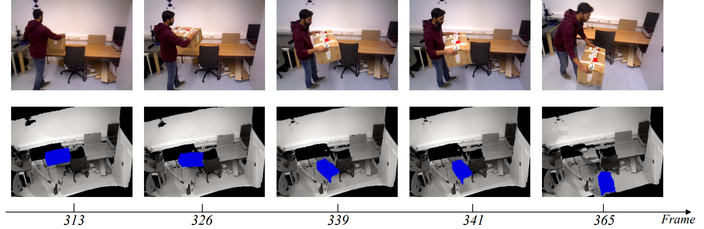

# IOFusion
Instance Segmentation and Optical Flow Guided 3D Reconstruction in Dynamic Scenes

  

Our environments: ubuntu18.04/GCC7.5/ GPU: RTX2080ti. 
Configuration required 
RAFT: https://github.com/princeton-vl/RAFT 
SOLO: https://github.com/WXinlong/SOLO 
ORBSLAM3: https://github.com/UZ-SLAMLab/ORB_SLAM3 

Our code is tested on:
* CMake 3.10.0
* Eigen 3.3.7
* NVIDIA CUDA 10.2
* OpenCV 4.5.5
* pytorch 1.6.0
* ceres 1.14
* Sophus 1.0
* g2o 2.1.0

video address:https://www.bilibili.com/video/BV1EV4y1D7GK/ 

The annotated dataset is available at annotations folder.
